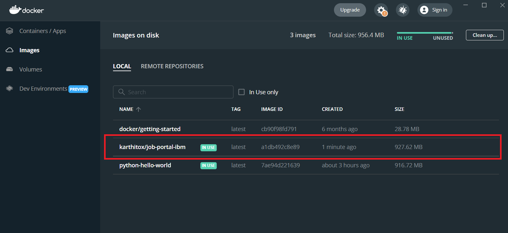
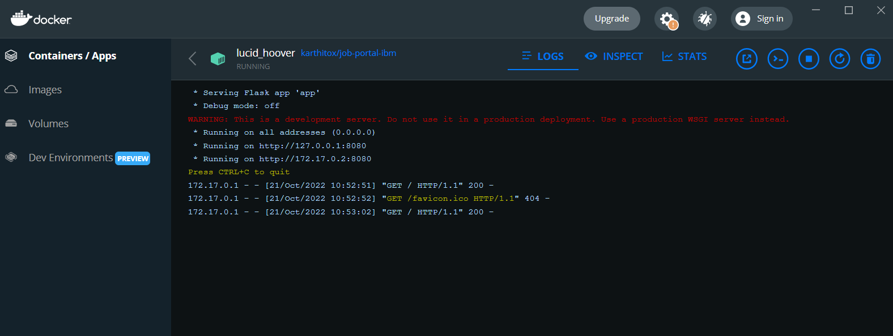
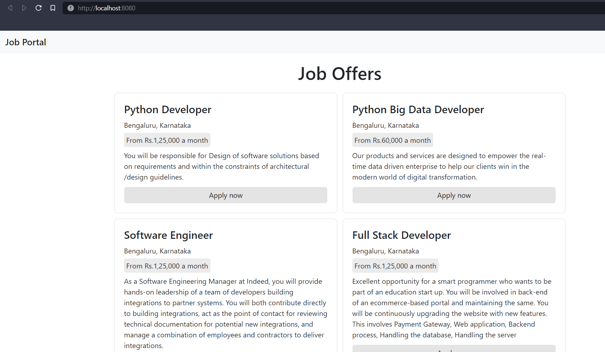

# Create a docker file for the jobportal application and deploy it in Docker desktop application. 

### step-1 (Build a docker image of job portal app)

```shell
docker build -t app/job-portal-ibm ./
```

### step-2 (run job portal app image)

```shell
docker run -p 8080:8080 app/job-portal-ibm
```

### finally, visit [localhost:8080](https://localhost:8080)

## How to run without docker? 

- ```python -m flask run```  
- (or)  
- ```flask run```
- visit localhost:5000

### Create a IBM container registry and deploy helloworld app or jobportalapp.

docker hub link: [https://hub.docker.com/r/karthitox/job-portal-ibm](https://hub.docker.com/r/karthitox/job-portal-ibm)

ibm cr upload: 

## output (runing locally on )





