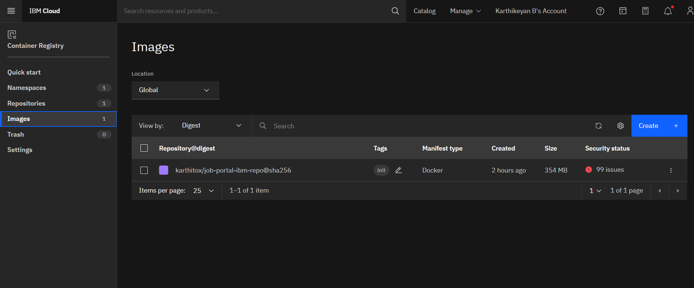

# Assignment - 4

Assignment Kubernetes / Docker 

- [x] [Pull an Image from docker hub and run it in docker playground](run-on-docker-playground)
- [x] [Create a docker file for the jobportal application and deploy it in Docker desktop application](jobportal-app)
- [x] Create a IBM container registry and deploy helloworld app or jobportalapp. 
- [] Create a Kubernetes cluster in IBM cloud and deploy helloworld image or jobportal image and also expose the same app to run in nodeport.

### 1. Pull an Image from docker hub and run it in docker playground.

[view the explaination document](run-on-docker-playground/readme.md)

### 2. Create a docker file for the jobportal application and deploy it in Docker desktop application

[view the app](jobportal-app)

### 3. Create a IBM container registry and deploy helloworld app or jobportalapp. 

docker hub link: [https://hub.docker.com/r/karthitox/job-portal-ibm](https://hub.docker.com/r/karthitox/job-portal-ibm)

ibm container registry upload 👇 