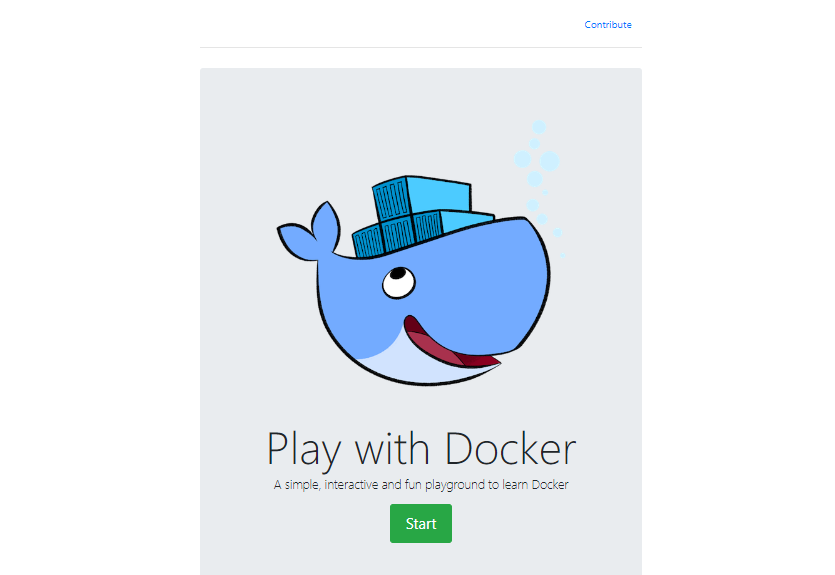
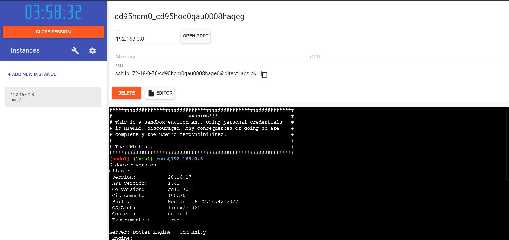
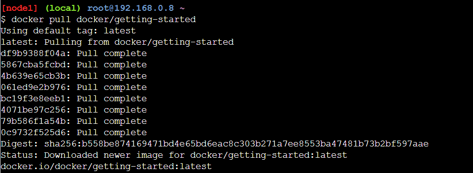
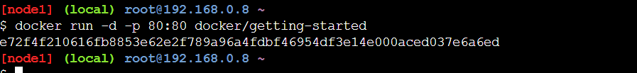
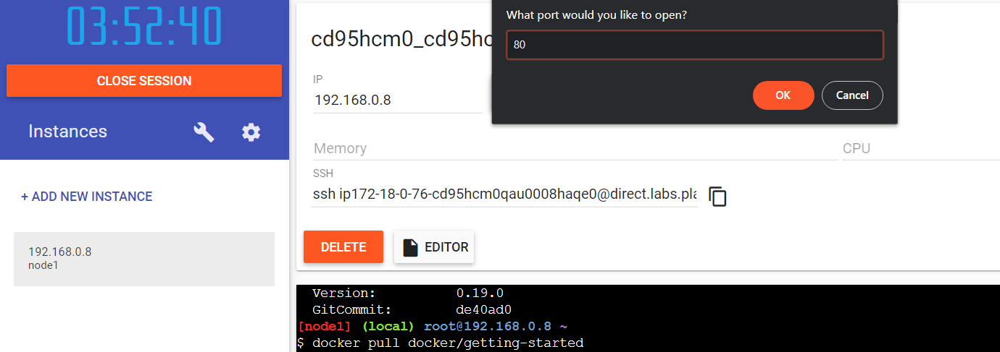
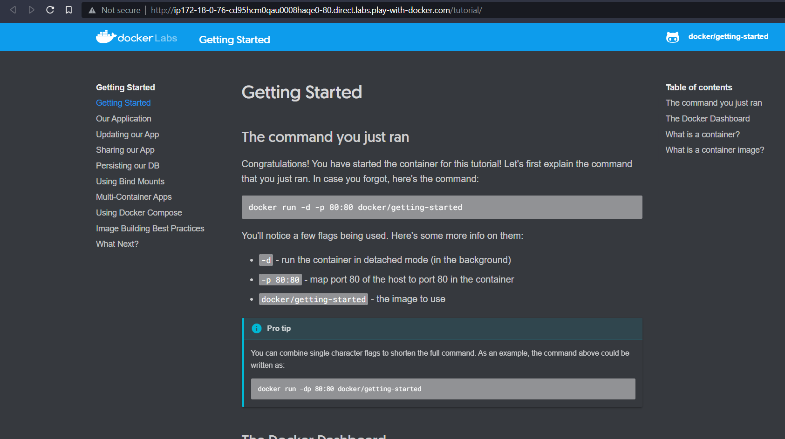

# Pull an Image from docker hub and run it in docker playground

## Step-1

go-to [labs.play-with-docker.com](https://labs.play-with-docker.com)

## Step-2

Login using docker hub account & create new instance

## Step-3

pull docker/getting-started from docker hub using  ` docker pull docker/getting-started `

## Step-4

run docker/getting-started using  `docker run -d -p 80:80 docker/getting-started `

## Step-5 

open the port 80

## Output

