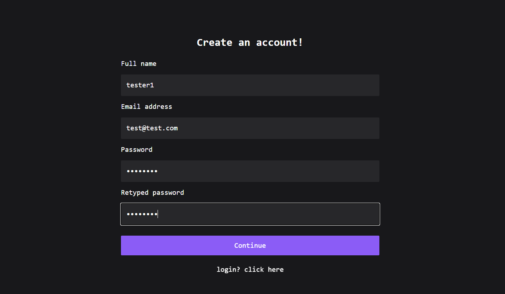

## Sprint 1

The code is present in the [./app](./app) dir.

## Stories

- [x] As a user, I can register for the application by entering my email, password, and confirming my password.
- [x] As a user, I can log into the application by entering email & password
- [x] As a user, I will receive confirmation email once I have registered for the application. (pending sendgrid is not approved yet.)

## Screenshots

