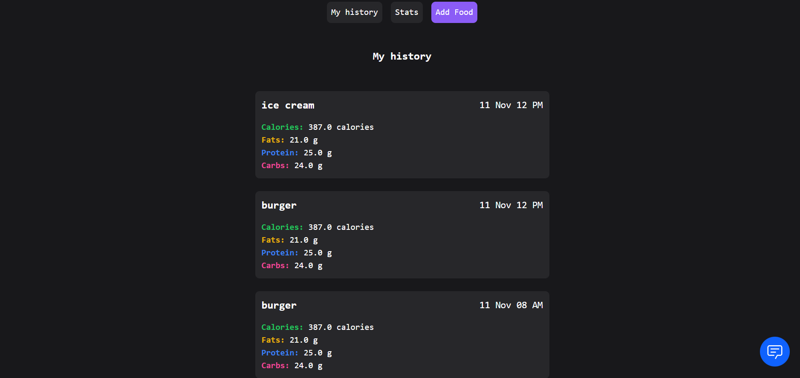
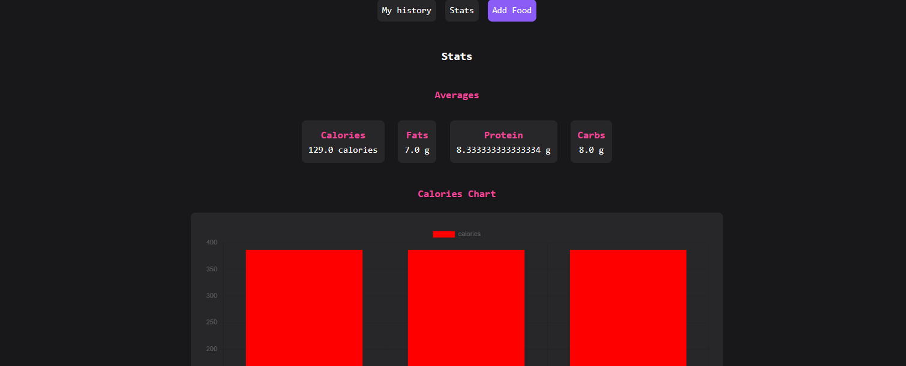
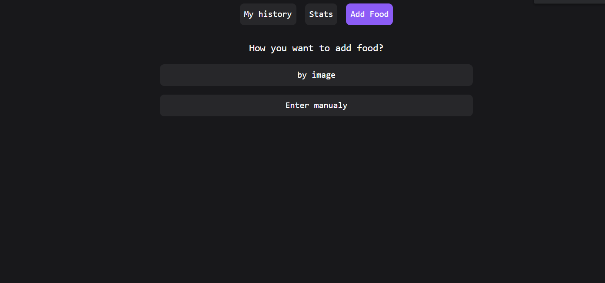
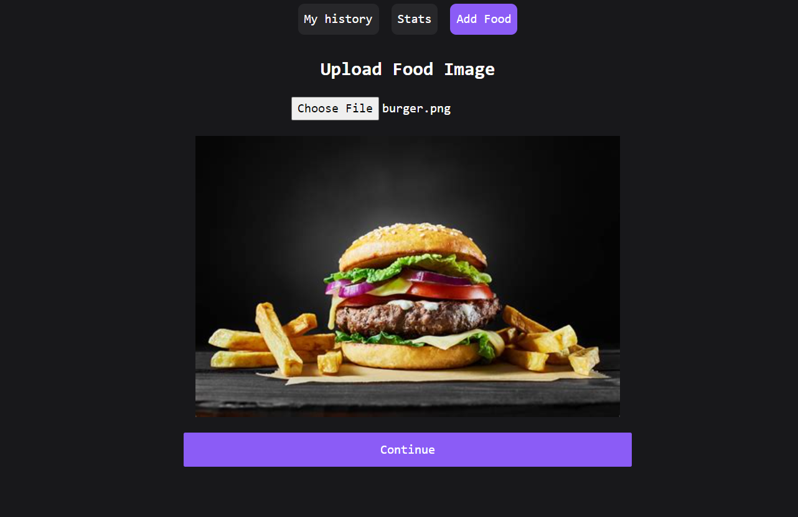
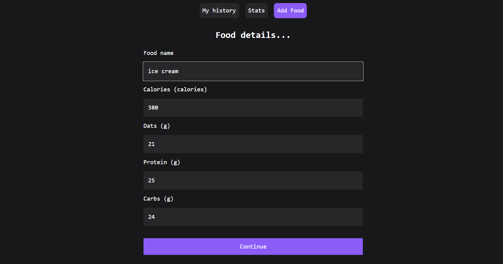

## Sprint 2

The code is present in the [./app](./app) dir.

## Stories

- [x] As a user, I can see the homepage by log into the application
- [x] As a user, I can see the upload page by navigating using navigation bar
- [x] As a user, I can upload my food image by using pick from gallery
- [x] As a user, I can get the ingredients of the food and nutritional details of food by using AI-Driven Food Detection Model

## screenshots

