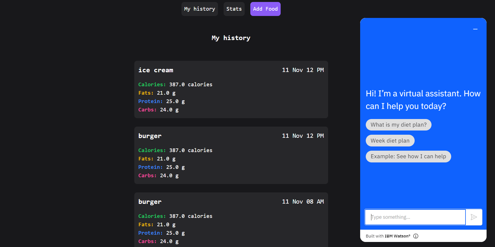
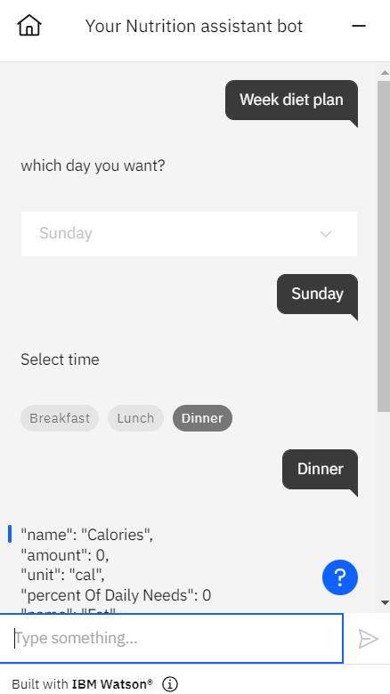

## Sprint 3

The bot is present in the [bot html](./bot.html)

## Stories

- [x] As a user, I can see my diet history by navigating using navigation bar
- [x] As a user, I can get some diet plans by queries nutrition API
- [x] As a user, I can get some diet based queries by using the chat bot

## Screenshots

