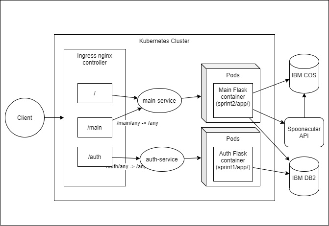

# K8s cluster deployment procedure (NAA APP)



## IBM free k8s cluster deployments

- k8s cluster 1: [naa-app-on-cluster-1.com](http://159.122.174.233:30991/main/), (expires after: 30-11-22)
- k8s cluster 2: [naa-app-on-cluster-2.com](http://169.51.204.20:30634/main/), (expires after: 20-12-22)

## How to deploy localy?

### Installing Nginx ingress
---

Nginx installation guide, [https://kubernetes.github.io/ingress-nginx/deploy/](https://kubernetes.github.io/ingress-nginx/deploy/)

`kubectl apply -f https://raw.githubusercontent.com/kubernetes/ingress-nginx/controller-v1.5.1/deploy/static/provider/cloud/deploy.yaml`

### Set k8s secrets
---

_**set Secrets in [auth-secret.yaml](auth-secret.yaml)**_

**IBM DB2**

You can get credentials from [https://cloud.ibm.com/catalog/services/db2](https://cloud.ibm.com/catalog/services/db2)

Format of the IBM_DB_URL

```sh
DATABASE=<databasename>;HOSTNAME=<your-hostname>;PORT=<portnumber>;SECURITY=SSL;UID=<username>;PWD=<password>
```

**Courier (Mail Service)**

- Create account in [https://www.courier.com](https://www.courier.com)
- Integrate Gmail into the courier platform. [How to integrate gmail?](https://www.courier.com/docs/guides/providers/email/gmail/)
- get auth key from Courier [How to get?](https://www.courier.com/docs/reference/authorization/)
- For more reference, refer [docs](https://www.courier.com/docs/)

Format of the Courier auth key

```sh
pk_prod_xxxxxxyyyyyy
```

_**set Secrets in [main-secret.yaml](main-secret.yaml)**_

**IBM Cloud Object Storage**

You can get credentials from [https://cloud.ibm.com/objectstorage/create](https://cloud.ibm.com/objectstorage/create)

Keys

```sh
COS_ENDPOINT=https://s3.jp-tok.cloud-object-storage.appdomain.cloud

COS_API_KEY_ID=<GET FROM IBM COS>

COS_INSTANCE_CRN=<GET FROM IBM COS>
```

**Spoonacular API**

You can get credentials from [https://spoonacular.com/food-api](https://spoonacular.com/food-api)

For more reference visit [here](https://github.com/ddsky/spoonacular-api-clients/tree/master/python)

Format of SPOONACULAR_API_KEY

```sh
bafif283hfndcdckkc
```

## Execution

1. Install Ingress with the following commands

```sh
kubectl apply -f https://raw.githubusercontent.com/kubernetes/ingress-nginx/controller-v1.5.1/deploy/static/provider/cloud/deploy.yaml
```

2. Create _naa-app_ namespace with the following commands

```sh
kubectl apply -f namespace-app.yaml
```

3. Fill [auth-secret.yaml](auth-secret.yaml) & [main-secret.yaml](main-secret.yaml) and execute the following commands

```sh
kubectl apply -f auth-secret.yaml
kubectl apply -f main-secret.yaml
```

4. Create deployments & ingress with the following commands

```sh
kubectl apply -f auth.yaml
kubectl apply -f main.yaml
kubectl apply -f ingress.yaml
```

5. Execute this command to view the status of the deployment

```sh
kubectl get all -n=naa-app
```

6. **Visit http://localhost:80/main/** to view th NAA app

## Complete cluster eployment

```sh
kubectl apply -f https://raw.githubusercontent.com/kubernetes/ingress-nginx/controller-v1.5.1/deploy/static/provider/cloud/deploy.yaml

kubectl apply -f namespace-app.yaml
kubectl apply -f auth-secret.yaml
kubectl apply -f main-secret.yaml
kubectl apply -f auth.yaml
kubectl apply -f main.yaml
kubectl apply -f ingress.yaml
kubectl get all -n=naa-app
```